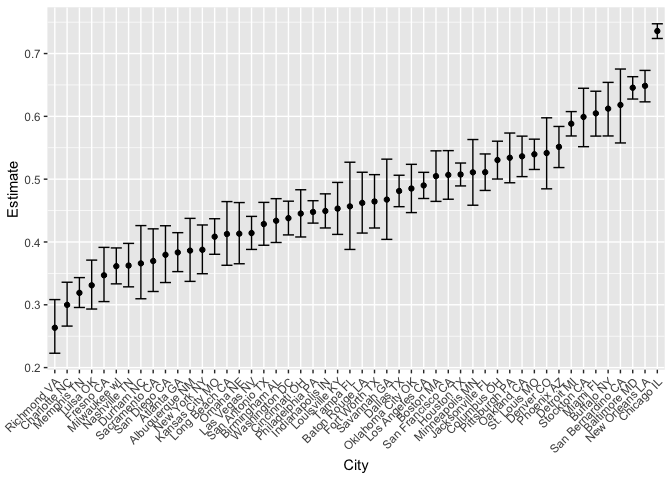
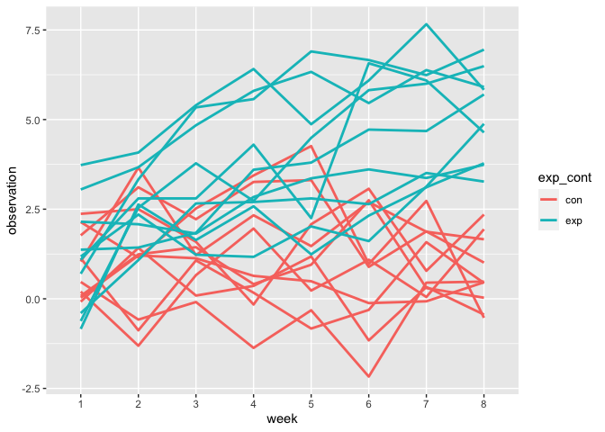

p8105\_hw5\_js5959
================
Junzhe Shao
11/20/2021

## Problem 1

``` r
homicide_data_raw <- read_csv("homicide-data.csv", na = c("","unknown"))
```

    ## Rows: 52179 Columns: 12

    ## ── Column specification ────────────────────────────────────────────────────────
    ## Delimiter: ","
    ## chr (9): uid, victim_last, victim_first, victim_race, victim_age, victim_sex...
    ## dbl (3): reported_date, lat, lon

    ## 
    ## ℹ Use `spec()` to retrieve the full column specification for this data.
    ## ℹ Specify the column types or set `show_col_types = FALSE` to quiet this message.

Data has 52179 observations. number of variables is 12 , and they are
uid, reported\_date, victim\_last, victim\_first, victim\_race,
victim\_age, victim\_sex, city, state, lat, lon, disposition.

``` r
homicide_data_process <- homicide_data_raw %>%
  mutate(
    city_state = paste(city,state)
  )
homicide_dt <- homicide_data_process %>%
  group_by(city_state) %>%
  summarize(
    homicide = n(),
    disposition = disposition
  ) %>%
  filter(disposition %in% c("Closed without arrest","Open/No arrest")) %>%
  group_by(city_state) %>%
  summarize(
    unsolved = n(),
    homicide = homicide
  ) %>%
  distinct()
```

    ## `summarise()` has grouped output by 'city_state'. You can override using the `.groups` argument.
    ## `summarise()` has grouped output by 'city_state'. You can override using the `.groups` argument.

``` r
homicide_dt
```

    ## # A tibble: 50 × 3
    ## # Groups:   city_state [50]
    ##    city_state     unsolved homicide
    ##    <chr>             <int>    <int>
    ##  1 Albuquerque NM      146      378
    ##  2 Atlanta GA          373      973
    ##  3 Baltimore MD       1825     2827
    ##  4 Baton Rouge LA      196      424
    ##  5 Birmingham AL       347      800
    ##  6 Boston MA           310      614
    ##  7 Buffalo NY          319      521
    ##  8 Charlotte NC        206      687
    ##  9 Chicago IL         4073     5535
    ## 10 Cincinnati OH       309      694
    ## # … with 40 more rows

``` r
baltimore_dt <- homicide_dt %>%
  filter(city_state == "Baltimore MD")
baltimore_prop_test <- prop.test(pull(baltimore_dt,unsolved),pull(baltimore_dt,homicide))
broom::tidy(baltimore_prop_test)
```

    ## # A tibble: 1 × 8
    ##   estimate statistic  p.value parameter conf.low conf.high method    alternative
    ##      <dbl>     <dbl>    <dbl>     <int>    <dbl>     <dbl> <chr>     <chr>      
    ## 1    0.646      239. 6.46e-54         1    0.628     0.663 1-sample… two.sided

``` r
city_dt <- homicide_dt %>%
  mutate(
    prop_test = map2(unsolved, homicide, prop.test),
    prop_test = map(prop_test, broom::tidy)
  ) %>%
  unnest(cols = prop_test) %>%
  select(city_state,estimate,conf.low,conf.high)
city_dt
```

    ## # A tibble: 50 × 4
    ## # Groups:   city_state [50]
    ##    city_state     estimate conf.low conf.high
    ##    <chr>             <dbl>    <dbl>     <dbl>
    ##  1 Albuquerque NM    0.386    0.337     0.438
    ##  2 Atlanta GA        0.383    0.353     0.415
    ##  3 Baltimore MD      0.646    0.628     0.663
    ##  4 Baton Rouge LA    0.462    0.414     0.511
    ##  5 Birmingham AL     0.434    0.399     0.469
    ##  6 Boston MA         0.505    0.465     0.545
    ##  7 Buffalo NY        0.612    0.569     0.654
    ##  8 Charlotte NC      0.300    0.266     0.336
    ##  9 Chicago IL        0.736    0.724     0.747
    ## 10 Cincinnati OH     0.445    0.408     0.483
    ## # … with 40 more rows

``` r
city_dt %>%
  arrange(estimate) %>%
  ggplot(aes(x = fct_reorder(city_state,estimate), y = estimate)) +
  geom_point() +
  geom_errorbar(aes(ymin = conf.low, ymax = conf.high)) +
  labs(
    x = "City",
    y = "Estimate"
  ) +
  theme(axis.text.x = element_text(angle = 45, hjust = 1))
```

<!-- -->

## Problem 2

Create a tidy dataframe containing data from all participants, including
the subject ID, arm, and observations over time:

``` r
filenames = tibble(list.files(path = "./data"),)
read_list <- function(x){
  file = paste("./data/",x, sep = "")
  print(file)
  read_csv(file) %>% 
    mutate(name = x, .before=week_1)
}

test <- bind_rows(map(.x = filenames, read_list)) %>%
      rowwise() %>% 
      mutate(exp_cont = str_split(name,"_")[[1]][1],
           subject_ID = str_split(str_split(name,"_")[[1]][2],"[.]")[[1]][1], .after = name,
           exp_ID = str_split(name,"[.]")[[1]][1])
```

    ##  [1] "./data/con_01.csv" "./data/con_02.csv" "./data/con_03.csv"
    ##  [4] "./data/con_04.csv" "./data/con_05.csv" "./data/con_06.csv"
    ##  [7] "./data/con_07.csv" "./data/con_08.csv" "./data/con_09.csv"
    ## [10] "./data/con_10.csv" "./data/exp_01.csv" "./data/exp_02.csv"
    ## [13] "./data/exp_03.csv" "./data/exp_04.csv" "./data/exp_05.csv"
    ## [16] "./data/exp_06.csv" "./data/exp_07.csv" "./data/exp_08.csv"
    ## [19] "./data/exp_09.csv" "./data/exp_10.csv"

    ## Rows: 20 Columns: 8

    ## ── Column specification ────────────────────────────────────────────────────────
    ## Delimiter: ","
    ## dbl (8): week_1, week_2, week_3, week_4, week_5, week_6, week_7, week_8

    ## 
    ## ℹ Use `spec()` to retrieve the full column specification for this data.
    ## ℹ Specify the column types or set `show_col_types = FALSE` to quiet this message.

``` r
plot_dt = pivot_longer(test,
                        week_1:week_8,
                        names_to = "week",
                        names_prefix = "week_",
                        values_to = "observation")

plot_dt %>% group_by(exp_ID) %>% ggplot(aes(x = week, y = observation, group = exp_ID, color = exp_cont))+geom_line(size =1)
```

<!-- -->

We can see experiment arm has an increasing trend while control arms has
no clear trend. experiment arm observation is larger than control arm in
general.

## Problem 3

``` r
set.seed(10)

iris_with_missing = iris %>% 
  map_df(~replace(.x, sample(1:150, 20), NA)) %>%
  mutate(Species = as.character(Species))

fill_missing <- function(x){
  if(is.numeric(x)){
    x = ifelse(is.na(x), mean(x, na.rm = T), x)
  }
  else if(is.character(x)){
    x = ifelse(is.na(x), "virginica",x)
  }
}
  
fill_dt <- map_df(iris_with_missing,fill_missing)

fill_dt
```

    ## # A tibble: 150 × 5
    ##    Sepal.Length Sepal.Width Petal.Length Petal.Width Species
    ##           <dbl>       <dbl>        <dbl>       <dbl> <chr>  
    ##  1         5.1          3.5         1.4         0.2  setosa 
    ##  2         4.9          3           1.4         0.2  setosa 
    ##  3         4.7          3.2         1.3         0.2  setosa 
    ##  4         4.6          3.1         1.5         1.19 setosa 
    ##  5         5            3.6         1.4         0.2  setosa 
    ##  6         5.4          3.9         1.7         0.4  setosa 
    ##  7         5.82         3.4         1.4         0.3  setosa 
    ##  8         5            3.4         1.5         0.2  setosa 
    ##  9         4.4          2.9         1.4         0.2  setosa 
    ## 10         4.9          3.1         3.77        0.1  setosa 
    ## # … with 140 more rows
